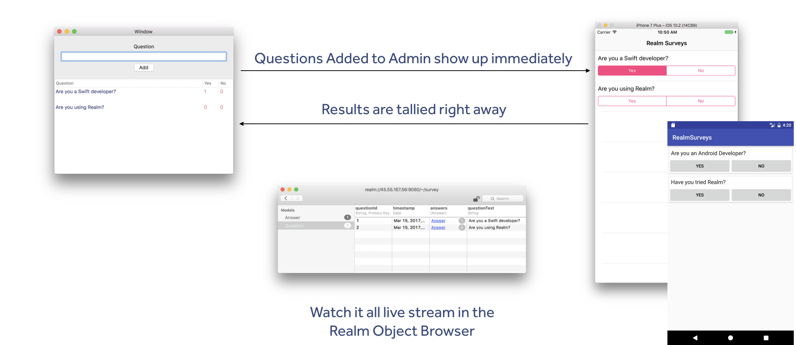

# Realm-Surveys
A reactive survey application where an Admin can enter survey questions in Realtime and tally responses.

# Features

- [x] Stream questions as they stream in realtime.
- [x] Answer each question only once
- [x] Watch the results tally right away

# Requirements

* Realm Mobile Platform

# Setting Up Realm Mobile Platform

In order to properly use Realm Puzzle, an instance of the Realm Object Server must be running for which each client copy of the app can connect.

* The [macOS version](https://realm.io/docs/get-started/installation/mac/) can be downloaded and run as a `localhost` on any desktop Mac.
* The [Linux version](https://realm.io/docs/get-started/installation/linux/) can be installed on a publicly accessible server and accessed over the internet.

# Building and Running

Follow the README files in the platform-specific subdirectory of this repository.

## Admin App

* [macOS](macOS)

## Client Apps

* [Android](Android)

* [iOS](iOS)

# Connecting to the Realm Mobile Platform
When launching the app each time, you'll be presented with a login form in order to connect to the right Realm Object Server instance.

For the server URL field, you may simply enter `localhost` if you're running out of the iOS Simulator with the Realm Object Server at the same time. For iOS devices running on the same network as that Mac, you can alt-click on the Wi-Fi icon in the macOS status bar to get the Mac's local IP address. You can then manually enter this into the server URL field on the iOS device.

You'll be required to create an admin account the first time you run an instance of the Realm Object Server. You may use this account when logging into Realm Survey by entering in the same username/password pair. Alternatively, you may also register new user accounts from the form by tapping the 'Register a new account' button.

# Known Issues

Android version animates items moving out of the Recycler View, but when you answer a question in the middle of the list of questions, the
animation fades out and back in questions that have moved up the list, instead of just moving them.  

# Contributing

See [CONTRIBUTING.md](CONTRIBUTING.md) for more details!

This project adheres to the [Contributor Covenant Code of Conduct](https://realm.io/conduct/). By participating, you are expected to uphold this code. Please report unacceptable behavior to [info@realm.io](mailto:info@realm.io).

# License

Distributed under the Apache license. See ``LICENSE`` for more information.

[1]: https://realm.io/news/introducing-realm-mobile-platform/
[2]: https://realm.io/docs/get-started/installation/mac/
[3]: https://realm.io/docs/get-started/installation/linux/
[4]: https://github.com/realm-demos/realm-draw/tree/master/Android
[5]: https://github.com/realm-demos/realm-draw/tree/master/Apple
[6]: https://github.com/realm-demos/realm-draw/tree/master/Xamarin
